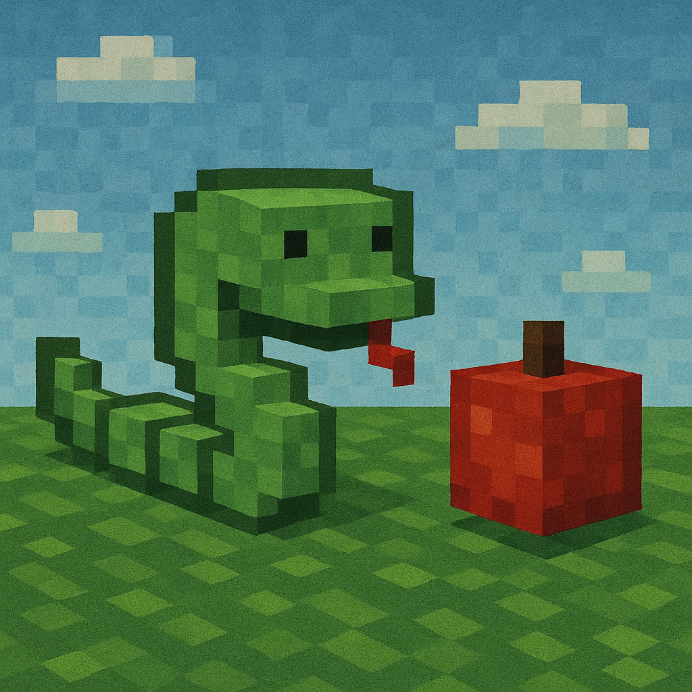

# 🐍 Snake Game – Classic Arcade Remake

A modern remake of the classic Snake game, built in Unity 2020.3.43f1.  
Smooth movement, retro pixel feel, and clean UI — now playable right in your browser!

[▶️ **Play on Itch.io**](https://el-legato.itch.io/pixel-snake-dx)  
_(No downloads. Just launch and play!)_

---

## 🎮 Features

- 🟢 Classic snake gameplay – eat and grow
- 💥 Avoid crashing into walls or yourself
- 🕹️ Keyboard support (WASD / Arrow keys)
- 📺 Scene switching (menu → game → restart)
- 🔊 Sound effects and optional music
- 🌐 WebGL build for browser play

---

## 📸 Screenshots

---

## 🚀 How to Run Locally

1. Clone or download this repository  
2. Open the project in Unity Hub (version 2020.3.43f1 LTS)  
3. Load the `Scenes/Main.unity` scene  
4. Press ▶️ Play or build to WebGL (File → Build Settings)

---

## 🛠️ Tech Stack

- **Unity** 2020.3.43f1 LTS
- **C#** for gameplay and input logic
- Unity's built-in UI system
- Keyboard input via `Input.GetKey()`
- Scene management (`SceneManager`)

---

## 🗂️ Project Structure

Assets/
├── Art/ # Sprites and visuals
├── Audio/ # Music and sound effects
├── Prefabs/ # Snake parts, fruit
├── Scripts/ # Game logic
├── Scenes/ # Game and menu
├── UI/ # Buttons, fonts
---

## 👨‍💻 Author

**Tony (Legato12)**  
This project was made as part of my personal Unity portfolio.  
Thanks for playing!

---

## 📄 License

Free to use, learn from, or build on. Credit is appreciated but not required.
